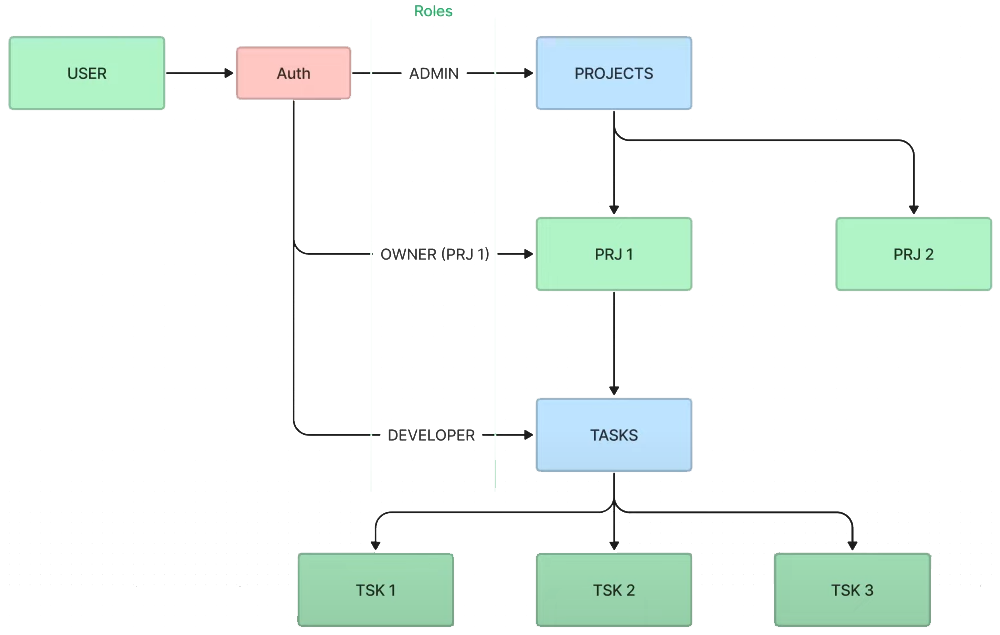

<p align="center">
  <a href="http://nestjs.com/" target="blank"></a>
</p>

# Task Manager

## Description

This project presents a server with three main entities: user, project and task. In addition, the server works with authentication and roles for the different administration tasks. The architecture with the server design is shown below.

<table>
  <tr>
    <td align="center" valign="center"></td>
  </tr>
 </table>

## Installation

Clone this repository

```bash
git clone
```

Install dependencies

```bash
$ yarn
```

You need Nest CLI

```bash
$ npm i -g @nestjs/cli
```

Configure and start Database (in the root project)

```bash
docker-compose up -d
```

Clone `.env.template` file and rename to `.env`

Complete environment variables

## Running the app

```bash
# development
$ yarn start

# watch mode
$ yarn start:dev

# production mode
$ yarn start:prod
```

## Endpoints

<!-- You can find all endpoints here: -->

## My process

### Built with

- Nest JS
- Typescript

### What I learned

- Nest with TypeScript

## Stay in touch

- Website - [www.bryan-aguilar.com](https://www.bryan-aguilar.com/)
- Medium - [baguilar6174](https://baguilar6174.medium.com/)
- LinkeIn - [baguilar6174](https://www.linkedin.com/in/baguilar6174)
